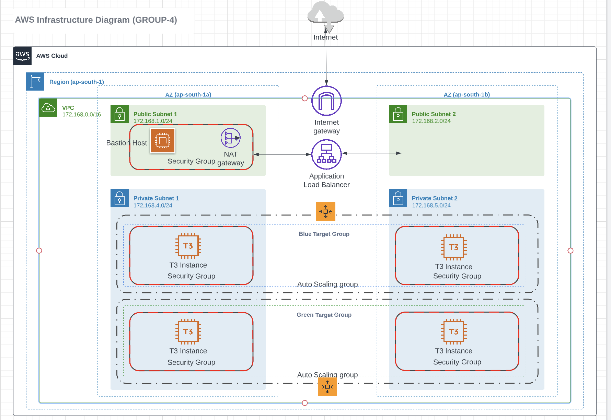

# blue-green-vpc

# Infra Diagram

<!-- BEGIN_TF_DOCS -->
## Requirements

No requirements.

## Providers

| Name | Version |
|------|---------|
|  [aws](#provider\_aws) | 4.31.0 |

## Modules

No modules.

## Resources

| Name | Type |
|------|------|
| [aws_eip.nat_eip](https://registry.terraform.io/providers/hashicorp/aws/latest/docs/resources/eip) | resource |
| [aws_internet_gateway.igw](https://registry.terraform.io/providers/hashicorp/aws/latest/docs/resources/internet_gateway) | resource |
| [aws_nat_gateway.nat_gw](https://registry.terraform.io/providers/hashicorp/aws/latest/docs/resources/nat_gateway) | resource |
| [aws_route_table.internet_route_tbl](https://registry.terraform.io/providers/hashicorp/aws/latest/docs/resources/route_table) | resource |
| [aws_route_table.nat_route_tbl](https://registry.terraform.io/providers/hashicorp/aws/latest/docs/resources/route_table) | resource |
| [aws_route_table_association.private_1](https://registry.terraform.io/providers/hashicorp/aws/latest/docs/resources/route_table_association) | resource |
| [aws_route_table_association.private_2](https://registry.terraform.io/providers/hashicorp/aws/latest/docs/resources/route_table_association) | resource |
| [aws_route_table_association.public_1](https://registry.terraform.io/providers/hashicorp/aws/latest/docs/resources/route_table_association) | resource |
| [aws_route_table_association.public_2](https://registry.terraform.io/providers/hashicorp/aws/latest/docs/resources/route_table_association) | resource |
| [aws_subnet.private_1](https://registry.terraform.io/providers/hashicorp/aws/latest/docs/resources/subnet) | resource |
| [aws_subnet.private_2](https://registry.terraform.io/providers/hashicorp/aws/latest/docs/resources/subnet) | resource |
| [aws_subnet.public_1](https://registry.terraform.io/providers/hashicorp/aws/latest/docs/resources/subnet) | resource |
| [aws_subnet.public_2](https://registry.terraform.io/providers/hashicorp/aws/latest/docs/resources/subnet) | resource |
| [aws_vpc.bg_vpc](https://registry.terraform.io/providers/hashicorp/aws/latest/docs/resources/vpc) | resource |

## Inputs

| Name | Description | Type | Default | Required |
|------|-------------|------|---------|:--------:|
|  [aws\_region](#input\_aws\_region) | The region to deploy resources | `string` | n/a | yes |
|  [az\_1](#input\_az\_1) | The region to deploy resources | `string` | n/a | yes |
|  [az\_2](#input\_az\_2) | The region to deploy resources | `string` | n/a | yes |
|  [cidr\_private\_1](#input\_cidr\_private\_1) | This is the CIRD block of the private subnet\_1 | `any` | n/a | yes |
|  [cidr\_private\_2](#input\_cidr\_private\_2) | This is the CIRD block of the private subnet\_2 | `any` | n/a | yes |
|  [cidr\_public\_1](#input\_cidr\_public\_1) | This is the CIDR of the public subnet\_1 | `any` | n/a | yes |
|  [cidr\_public\_2](#input\_cidr\_public\_2) | This is the CIDR of the public subnet\_2 | `any` | n/a | yes |
|  [vpc\_cidr](#input\_vpc\_cidr) | This is the CIDR of VPC | `any` | n/a | yes |
|  [vpc\_name](#input\_vpc\_name) | This is the VPC name | `string` | n/a | yes |

## Outputs

No outputs.
<!-- END_TF_DOCS -->